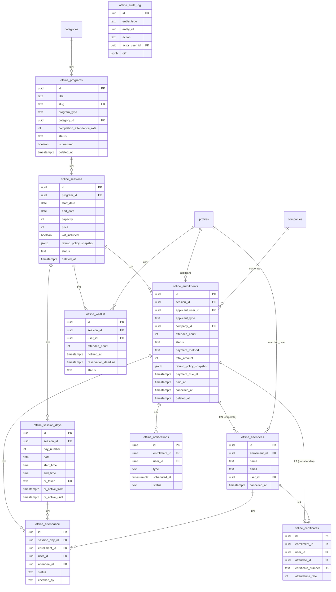

# 오프라인 교육 데이터 모델 — 정밀 설계 v2

> 프로젝트: Ingrow LMS  
> 작성일: 2026-05-11  
> 목적: 1차 PRD(`FEATURE_OFFLINE_EDUCATION.md`)의 데이터 모델을 운영 관점에서 정밀화함  
> 대상: Claude Code에서 직접 마이그레이션 SQL로 실행 가능한 수준의 명세

---

## 목차

1. [v1 대비 변경 요약](#1-v1-대비-변경-요약)
2. [설계 원칙](#2-설계-원칙)
3. [ERD](#3-erd)
4. [테이블별 상세](#4-테이블별-상세)
5. [상태 전이(State Machine)](#5-상태-전이state-machine)
6. [동시성·정원 카운팅 로직](#6-동시성정원-카운팅-로직)
7. [트리거 & 함수](#7-트리거--함수)
8. [RLS 정책](#8-rls-정책)
9. [감사 로그(Audit Log)](#9-감사-로그audit-log)
10. [마이그레이션 실행 순서](#10-마이그레이션-실행-순서)
11. [결정 필요 사항](#11-결정-필요-사항)

---

## 1. v1 대비 변경 요약

| # | 영역 | v1 | v2 |
|---|------|----|----|
| 1 | 정원 카운팅 | 앱 코드에서 SELECT COUNT | DB 함수 + 행 락(FOR UPDATE)으로 경쟁 조건 차단 |
| 2 | 상태 전이 | 모든 전이 허용 | 트리거로 유효 전이만 허용 |
| 3 | 출석 UNIQUE | NULL 허용 컬럼에 UNIQUE | 부분 인덱스(WHERE NOT NULL)로 분리 |
| 4 | 삭제 정책 | CASCADE 일관성 없음 | RESTRICT 기본 + `deleted_at` 소프트 삭제 |
| 5 | 환불 정책 | 글로벌 설정만 참조 | 신청 시점 정책 스냅샷 컬럼 추가 |
| 6 | 알림 중복 | 중복 발송 가능 | `(enrollment_id, type)` 부분 UNIQUE 인덱스 |
| 7 | RLS | 미정의 | 모든 테이블에 정책 정의 |
| 8 | 트리거 | 없음 | `updated_at` 자동 갱신 + 결제 시 정원 검증 |
| 9 | 가격 정보 | 단일 price | `price`/`vat_included` 분리 + 신청 시점 스냅샷 |
| 10 | 단체 신청 인원 | enrollment.attendee_count | `attendees` 행 수와 일치 강제 (트리거) |
| 11 | 대기열 순번 | 컬럼 저장 | `created_at` 기준 동적 계산 (재정렬 비용 제거) |
| 12 | QR 토큰 | TEXT UNIQUE | 32바이트 base64url 강제 + 활성 시간 generated column |
| 13 | 신규 테이블 | — | `offline_audit_log` 추가 |

---

## 2. 설계 원칙

- **외부에 노출되는 잔여석은 결제 완료(`confirmed`) 기준으로만 계산함.** 가확보(`pending_payment`)는 운영자만 보는 지표
- **데이터 삭제는 기본적으로 차단함.** 모든 도메인 테이블에 `deleted_at TIMESTAMPTZ` 컬럼을 두고 소프트 삭제 사용
- **상태 전이는 DB 트리거에서 검증함.** 앱 버그로 인한 비정상 전이 차단
- **금전 관련 정보는 스냅샷을 박음.** 환불 정책, 가격, VAT 정책은 신청 시점 값을 enrollment에 저장 → 정책 변경이 기존 신청자에게 소급 적용되는 사고 방지
- **모든 도메인 변경은 `offline_audit_log`에 기록함.** 결제·취소·환불·관리자 액션 추적 가능
- **시간은 모두 `TIMESTAMPTZ`로 통일함.** 클라이언트에서 KST로 변환
- **PostgreSQL 함수로 정원 검증함.** `SELECT … FOR UPDATE`로 행 락 잡고 INSERT 트랜잭션 처리

---

## 3. ERD



---

## 4. 테이블별 상세

> 공통 사항: 모든 테이블에 아래 컬럼이 자동 포함됨
> - `created_at TIMESTAMPTZ DEFAULT now()`
> - `updated_at TIMESTAMPTZ DEFAULT now()` (트리거로 자동 갱신)
> - 도메인 테이블에는 `deleted_at TIMESTAMPTZ` (소프트 삭제용)

---

### 4-1. `offline_programs` — 프로그램 마스터

**역할:** 강좌 마스터. 한 프로그램이 N개 회차를 가짐.

```sql
CREATE TABLE offline_programs (
  id               UUID PRIMARY KEY DEFAULT gen_random_uuid(),
  title            TEXT NOT NULL,
  slug             TEXT NOT NULL UNIQUE,
  description      TEXT,
  category_id      UUID REFERENCES categories(id) ON DELETE SET NULL,
  thumbnail_url    TEXT,

  program_type     TEXT NOT NULL CHECK (program_type IN (
                     'workshop', 'regular_course', 'corporate'
                   )),

  instructor_name  TEXT,
  instructor_bio   TEXT,

  what_you_learn   TEXT[] NOT NULL DEFAULT '{}',
  requirements     TEXT[] NOT NULL DEFAULT '{}',
  target_audience  TEXT,

  completion_attendance_rate INT NOT NULL DEFAULT 80
                     CHECK (completion_attendance_rate BETWEEN 0 AND 100),

  status           TEXT NOT NULL DEFAULT 'draft'
                     CHECK (status IN ('draft', 'active', 'closed')),
  is_featured      BOOLEAN NOT NULL DEFAULT false,

  created_at       TIMESTAMPTZ NOT NULL DEFAULT now(),
  updated_at       TIMESTAMPTZ NOT NULL DEFAULT now(),
  deleted_at       TIMESTAMPTZ
);

-- 활성 프로그램만 조회하는 케이스가 대부분
CREATE INDEX idx_programs_active
  ON offline_programs(status, is_featured, created_at DESC)
  WHERE deleted_at IS NULL;

CREATE INDEX idx_programs_category
  ON offline_programs(category_id)
  WHERE deleted_at IS NULL;

CREATE UNIQUE INDEX idx_programs_slug_active
  ON offline_programs(slug)
  WHERE deleted_at IS NULL;
```

**설계 포인트:**

- `slug`는 활성(`deleted_at IS NULL`) 행에 대해서만 unique 검사함 → 삭제 후 같은 slug 재사용 가능
- 모든 인덱스에 `WHERE deleted_at IS NULL` 부분 인덱스 적용 → 삭제된 행은 인덱스에서 빠짐

---

### 4-2. `offline_sessions` — 회차

**역할:** 한 프로그램의 실제 개설 단위. 정원·일정·장소·가격을 가짐.

```sql
CREATE TABLE offline_sessions (
  id               UUID PRIMARY KEY DEFAULT gen_random_uuid(),
  program_id       UUID NOT NULL REFERENCES offline_programs(id) ON DELETE RESTRICT,

  title            TEXT,
  start_date       DATE NOT NULL,
  end_date         DATE NOT NULL,

  capacity         INT NOT NULL CHECK (capacity > 0),

  -- 가격 (원 단위, VAT 처리는 별도 컬럼)
  price            INT NOT NULL DEFAULT 0 CHECK (price >= 0),
  vat_included     BOOLEAN NOT NULL DEFAULT true,

  -- 장소
  location_name    TEXT,
  location_address TEXT,
  location_url     TEXT,

  -- 결제 정책 (NULL이면 글로벌 site_settings 사용)
  payment_deadline_days         INT CHECK (payment_deadline_days > 0),
  payment_deadline_before_start INT CHECK (payment_deadline_before_start >= 0),

  -- 환불 정책 스냅샷 (이 회차에 적용될 정책)
  -- 회차 생성 시점에 글로벌 설정에서 복사. 회차 단위로 오버라이드 가능
  refund_policy    JSONB NOT NULL DEFAULT '{
    "full_refund_days_before": 7,
    "half_refund_days_before": 3
  }',

  status           TEXT NOT NULL DEFAULT 'open'
                     CHECK (status IN ('open', 'closed', 'cancelled', 'completed')),

  created_at       TIMESTAMPTZ NOT NULL DEFAULT now(),
  updated_at       TIMESTAMPTZ NOT NULL DEFAULT now(),
  deleted_at       TIMESTAMPTZ,

  -- 일정 무결성
  CONSTRAINT sessions_date_order CHECK (end_date >= start_date)
);

CREATE INDEX idx_sessions_program
  ON offline_sessions(program_id)
  WHERE deleted_at IS NULL;

CREATE INDEX idx_sessions_open
  ON offline_sessions(start_date, status)
  WHERE deleted_at IS NULL AND status = 'open';

-- 결제 기한 만료 cron이 쓰는 인덱스 (활성 회차의 다가오는 시작일)
CREATE INDEX idx_sessions_upcoming
  ON offline_sessions(start_date)
  WHERE deleted_at IS NULL AND status IN ('open', 'closed');
```

**설계 포인트:**

- `program_id ON DELETE RESTRICT` — 회차가 있는 프로그램은 삭제 불가. 강제로 지우려면 회차부터 처리해야 함
- `refund_policy`는 회차 단위 **스냅샷**. 회차 만들 때 글로벌 설정 복사하는 게 기본이지만, 회차별 오버라이드 가능
- `vat_included` — 가격에 VAT 포함 여부. 세금계산서 발행 시 별도 처리

---

### 4-3. `offline_session_days` — 회차 일자

**역할:** 한 회차의 실제 진행 일자. 정규과정이면 N개, 단발이면 1개. QR 토큰을 가짐.

```sql
CREATE TABLE offline_session_days (
  id               UUID PRIMARY KEY DEFAULT gen_random_uuid(),
  session_id       UUID NOT NULL REFERENCES offline_sessions(id) ON DELETE CASCADE,

  day_number       INT NOT NULL CHECK (day_number > 0),
  date             DATE NOT NULL,
  start_time       TIME NOT NULL,
  end_time         TIME NOT NULL,
  topic            TEXT,

  -- QR 토큰 (32바이트 base64url ≈ 43자)
  qr_token         TEXT NOT NULL UNIQUE
                     CHECK (length(qr_token) >= 32),

  -- 활성 시간 (회차 일자의 시작/종료에 ±N분 마진)
  -- 트리거에서 자동 계산: start_time - 30분 ~ start_time + 30분
  qr_active_from   TIMESTAMPTZ NOT NULL,
  qr_active_until  TIMESTAMPTZ NOT NULL,

  created_at       TIMESTAMPTZ NOT NULL DEFAULT now(),
  updated_at       TIMESTAMPTZ NOT NULL DEFAULT now(),

  CONSTRAINT session_days_time_order CHECK (end_time > start_time),
  CONSTRAINT session_days_qr_window  CHECK (qr_active_until > qr_active_from),
  UNIQUE (session_id, day_number)
);

CREATE INDEX idx_session_days_session ON offline_session_days(session_id);
CREATE INDEX idx_session_days_date    ON offline_session_days(date);
```

**설계 포인트:**

- `session_id ON DELETE CASCADE` — 회차가 지워지면 일자는 같이 사라져도 됨 (출석 데이터는 enrollment 쪽 cascade로 별도 보호)
- `qr_token`은 앱 코드에서 `crypto.randomBytes(32).toString('base64url')`로 생성
- `qr_active_from`/`until`은 트리거로 자동 계산 — `date + start_time` 기준 ± 글로벌 설정값(분)

---

### 4-4. `offline_enrollments` — 신청

**역할:** 개인/기업 단체 신청의 단일 진입점. 결제 정보·상태·환불을 모두 가짐.

```sql
CREATE TABLE offline_enrollments (
  id               UUID PRIMARY KEY DEFAULT gen_random_uuid(),
  session_id       UUID NOT NULL REFERENCES offline_sessions(id) ON DELETE RESTRICT,

  -- 신청자
  applicant_user_id UUID NOT NULL REFERENCES profiles(id) ON DELETE RESTRICT,
  applicant_type    TEXT NOT NULL CHECK (applicant_type IN ('individual', 'corporate')),

  -- 기업 단체 신청일 경우
  company_id              UUID REFERENCES companies(id) ON DELETE SET NULL,
  company_contact_name    TEXT,
  company_contact_phone   TEXT,
  company_contact_email   TEXT,

  -- 참석 인원 (단체 신청 시 attendees 행 수와 강제 일치 — 트리거)
  attendee_count   INT NOT NULL DEFAULT 1 CHECK (attendee_count >= 1),

  -- 상태
  status           TEXT NOT NULL DEFAULT 'pending_payment'
                     CHECK (status IN (
                       'pending_payment',
                       'confirmed',
                       'expired',
                       'cancelled',
                       'refunded'
                     )),

  -- 결제
  payment_method   TEXT CHECK (payment_method IN ('card', 'invoice')),

  -- 결제 금액 (신청 시점 가격 × 인원 — 스냅샷)
  unit_price       INT NOT NULL CHECK (unit_price >= 0),
  total_amount     INT NOT NULL CHECK (total_amount >= 0),
  vat_included     BOOLEAN NOT NULL,

  payment_due_at   TIMESTAMPTZ NOT NULL,
  paid_at          TIMESTAMPTZ,

  -- 환불 정책 스냅샷 (신청 시점의 sessions.refund_policy 복사)
  refund_policy_snapshot JSONB NOT NULL,

  -- 취소/환불
  cancelled_at     TIMESTAMPTZ,
  cancelled_by     TEXT CHECK (cancelled_by IN ('user', 'admin', 'system_expired')),
  refunded_at      TIMESTAMPTZ,
  refund_amount    INT CHECK (refund_amount IS NULL OR refund_amount >= 0),
  refund_rate      INT CHECK (refund_rate IS NULL OR refund_rate BETWEEN 0 AND 100),

  -- Stripe (카드 결제 시)
  stripe_session_id        TEXT,
  stripe_payment_intent_id TEXT,

  -- 세금계산서 (invoice 결제 시)
  invoice_issued_at           TIMESTAMPTZ,
  invoice_number              TEXT,
  invoice_paid_confirmed_at   TIMESTAMPTZ,
  invoice_paid_confirmed_by   UUID REFERENCES profiles(id),

  notes            TEXT,

  created_at       TIMESTAMPTZ NOT NULL DEFAULT now(),
  updated_at       TIMESTAMPTZ NOT NULL DEFAULT now(),
  deleted_at       TIMESTAMPTZ,

  -- 기업 신청이면 company_id 필수
  CONSTRAINT enrollments_corporate_company CHECK (
    applicant_type = 'individual' OR company_id IS NOT NULL
  ),

  -- 환불 정보 일관성
  CONSTRAINT enrollments_refund_consistency CHECK (
    (refunded_at IS NULL AND refund_amount IS NULL AND refund_rate IS NULL)
    OR
    (refunded_at IS NOT NULL AND refund_amount IS NOT NULL AND refund_rate IS NOT NULL)
  )
);

CREATE INDEX idx_enrollments_session
  ON offline_enrollments(session_id, status)
  WHERE deleted_at IS NULL;

CREATE INDEX idx_enrollments_applicant
  ON offline_enrollments(applicant_user_id)
  WHERE deleted_at IS NULL;

CREATE INDEX idx_enrollments_company
  ON offline_enrollments(company_id)
  WHERE deleted_at IS NULL AND company_id IS NOT NULL;

-- 결제 기한 만료 cron 전용
CREATE INDEX idx_enrollments_pending_payment_due
  ON offline_enrollments(payment_due_at)
  WHERE deleted_at IS NULL AND status = 'pending_payment';

-- 카드 결제 webhook 처리용
CREATE INDEX idx_enrollments_stripe_session
  ON offline_enrollments(stripe_session_id)
  WHERE stripe_session_id IS NOT NULL;
```

**설계 포인트:**

- **가격·환불 정책 스냅샷** — `unit_price`, `total_amount`, `vat_included`, `refund_policy_snapshot`을 신청 시점에 박음. 관리자가 회차 가격이나 정책을 변경해도 기존 신청은 영향 없음
- **session ON DELETE RESTRICT** — 신청이 있는 회차는 삭제 불가
- **applicant_user_id ON DELETE RESTRICT** — 신청자 탈퇴 시 신청 데이터 보존 필요. 익명화는 별도 처리
- **부분 인덱스** — `pending_payment` 상태만 인덱싱 → cron 쿼리 비용 절감

---

### 4-5. `offline_attendees` — 단체 참석자

**역할:** 기업 단체 신청 시 실제 참석자 명단.

```sql
CREATE TABLE offline_attendees (
  id               UUID PRIMARY KEY DEFAULT gen_random_uuid(),
  enrollment_id    UUID NOT NULL REFERENCES offline_enrollments(id) ON DELETE CASCADE,

  name             TEXT NOT NULL,
  email            TEXT,
  phone            TEXT,
  department       TEXT,
  position         TEXT,

  -- LMS 회원과 매칭되면 채워짐 (선택)
  user_id          UUID REFERENCES profiles(id) ON DELETE SET NULL,

  -- 부분 취소
  cancelled_at     TIMESTAMPTZ,

  created_at       TIMESTAMPTZ NOT NULL DEFAULT now(),
  updated_at       TIMESTAMPTZ NOT NULL DEFAULT now()
);

CREATE INDEX idx_attendees_enrollment
  ON offline_attendees(enrollment_id)
  WHERE cancelled_at IS NULL;

CREATE INDEX idx_attendees_user
  ON offline_attendees(user_id)
  WHERE user_id IS NOT NULL AND cancelled_at IS NULL;
```

**설계 포인트:**

- `enrollment_id ON DELETE CASCADE` — enrollment이 사라지면 참석자도 같이 사라짐
- `attendee_count`와 활성 attendees 행 수 일치는 **앱 + 트리거** 양쪽에서 보장 (§7 참조)

---

### 4-6. `offline_waitlist` — 대기열

**역할:** 마감된 회차의 대기 신청자.

```sql
CREATE TABLE offline_waitlist (
  id               UUID PRIMARY KEY DEFAULT gen_random_uuid(),
  session_id       UUID NOT NULL REFERENCES offline_sessions(id) ON DELETE CASCADE,
  user_id          UUID NOT NULL REFERENCES profiles(id) ON DELETE CASCADE,

  attendee_count   INT NOT NULL DEFAULT 1 CHECK (attendee_count >= 1),

  -- 자리 발생 시 알림
  notified_at            TIMESTAMPTZ,
  reservation_deadline   TIMESTAMPTZ,

  status           TEXT NOT NULL DEFAULT 'waiting'
                     CHECK (status IN ('waiting', 'notified', 'converted', 'expired')),

  created_at       TIMESTAMPTZ NOT NULL DEFAULT now(),
  updated_at       TIMESTAMPTZ NOT NULL DEFAULT now(),

  -- 한 사용자가 한 회차에 대기 1건만
  UNIQUE (session_id, user_id)
);

-- 대기 순번 조회는 created_at 기준 — 순번을 컬럼으로 저장하지 않음
-- 순번 = ROW_NUMBER() OVER (PARTITION BY session_id ORDER BY created_at)
CREATE INDEX idx_waitlist_session_order
  ON offline_waitlist(session_id, created_at)
  WHERE status IN ('waiting', 'notified');
```

**설계 포인트:**

- **순번을 컬럼으로 저장하지 않음** — 중간 사용자가 취소될 때마다 모든 행의 position을 재계산하는 비용 제거. 조회 시 `ROW_NUMBER()`로 동적 계산
- `notified` 상태인 사용자가 결제하지 않으면 `expired`로, 결제하면 `converted`로 전이

---

### 4-7. `offline_attendance` — 출석 기록

**역할:** 회차 일자 × 참석자 단위의 출석 1행.

```sql
CREATE TABLE offline_attendance (
  id                  UUID PRIMARY KEY DEFAULT gen_random_uuid(),
  session_day_id      UUID NOT NULL REFERENCES offline_session_days(id) ON DELETE CASCADE,
  enrollment_id       UUID NOT NULL REFERENCES offline_enrollments(id) ON DELETE CASCADE,

  -- 출석 대상 (둘 중 정확히 하나만 채워짐)
  user_id             UUID REFERENCES profiles(id),
  attendee_id         UUID REFERENCES offline_attendees(id) ON DELETE CASCADE,

  status              TEXT NOT NULL CHECK (status IN ('present', 'absent', 'late')),

  checked_at          TIMESTAMPTZ,
  checked_by          TEXT NOT NULL CHECK (checked_by IN ('self_qr', 'admin')),
  checked_by_admin_id UUID REFERENCES profiles(id),

  notes               TEXT,

  created_at          TIMESTAMPTZ NOT NULL DEFAULT now(),
  updated_at          TIMESTAMPTZ NOT NULL DEFAULT now(),

  -- 정확히 user_id 또는 attendee_id 하나만 채워져야 함
  CONSTRAINT attendance_subject_exclusive CHECK (
    (user_id IS NOT NULL AND attendee_id IS NULL)
    OR
    (user_id IS NULL AND attendee_id IS NOT NULL)
  )
);

-- 부분 UNIQUE 인덱스로 NULL 허용 컬럼의 UNIQUE 문제 해결
CREATE UNIQUE INDEX idx_attendance_unique_user
  ON offline_attendance(session_day_id, enrollment_id, user_id)
  WHERE user_id IS NOT NULL;

CREATE UNIQUE INDEX idx_attendance_unique_attendee
  ON offline_attendance(session_day_id, enrollment_id, attendee_id)
  WHERE attendee_id IS NOT NULL;

CREATE INDEX idx_attendance_enrollment
  ON offline_attendance(enrollment_id);

CREATE INDEX idx_attendance_session_day
  ON offline_attendance(session_day_id);
```

**v1 대비 핵심 차이:** PostgreSQL은 NULL을 unique 검사에서 동등하다고 보지 않음 → `UNIQUE (session_day_id, enrollment_id, attendee_id)` 같이 NULL 허용 컬럼을 포함하면 중복이 막히지 않음. **부분 인덱스(`WHERE … IS NOT NULL`)로 분리**해서 해결.

---

### 4-8. `offline_certificates` — 오프라인 수료증

```sql
CREATE TABLE offline_certificates (
  id                  UUID PRIMARY KEY DEFAULT gen_random_uuid(),
  enrollment_id       UUID NOT NULL REFERENCES offline_enrollments(id) ON DELETE RESTRICT,

  -- 수료증 발급 대상 (개인 또는 단체 참석자)
  user_id             UUID REFERENCES profiles(id),
  attendee_id         UUID REFERENCES offline_attendees(id),

  certificate_number  TEXT NOT NULL UNIQUE,
  attendance_rate     INT NOT NULL CHECK (attendance_rate BETWEEN 0 AND 100),

  issued_at           TIMESTAMPTZ NOT NULL DEFAULT now(),
  pdf_url             TEXT,

  -- 대상 강제 (정확히 하나)
  CONSTRAINT certificates_subject_exclusive CHECK (
    (user_id IS NOT NULL AND attendee_id IS NULL)
    OR
    (user_id IS NULL AND attendee_id IS NOT NULL)
  )
);

-- 한 enrollment × 한 user/attendee 조합당 수료증 1건만
CREATE UNIQUE INDEX idx_certificates_unique_user
  ON offline_certificates(enrollment_id, user_id)
  WHERE user_id IS NOT NULL;

CREATE UNIQUE INDEX idx_certificates_unique_attendee
  ON offline_certificates(enrollment_id, attendee_id)
  WHERE attendee_id IS NOT NULL;
```

---

### 4-9. `offline_notifications` — 알림 큐/로그

```sql
CREATE TABLE offline_notifications (
  id              UUID PRIMARY KEY DEFAULT gen_random_uuid(),
  enrollment_id   UUID REFERENCES offline_enrollments(id) ON DELETE CASCADE,
  user_id         UUID REFERENCES profiles(id),

  type            TEXT NOT NULL CHECK (type IN (
                    'application_received',
                    'payment_instruction',
                    'payment_due_3days',
                    'payment_due_1day',
                    'payment_expired',
                    'payment_confirmed',
                    'pre_event_2weeks',
                    'reminder_1day',
                    'attendance_checked_in',
                    'certificate_issued',
                    'survey_request',
                    'waitlist_available',
                    'cancellation_confirmed',
                    'session_cancelled'
                  )),

  channels        TEXT[] NOT NULL DEFAULT '{email,sms,in_app}',

  -- 발송 결과
  email_sent_at   TIMESTAMPTZ,
  sms_sent_at     TIMESTAMPTZ,
  in_app_read_at  TIMESTAMPTZ,

  scheduled_at    TIMESTAMPTZ NOT NULL,

  subject         TEXT,
  body            TEXT,

  status          TEXT NOT NULL DEFAULT 'pending'
                    CHECK (status IN ('pending', 'sent', 'failed')),
  error_message   TEXT,

  created_at      TIMESTAMPTZ NOT NULL DEFAULT now()
);

-- 발송 큐 처리용
CREATE INDEX idx_notifications_due
  ON offline_notifications(scheduled_at)
  WHERE status = 'pending';

CREATE INDEX idx_notifications_user
  ON offline_notifications(user_id, in_app_read_at)
  WHERE 'in_app' = ANY(channels);

-- 중복 발송 방지 — 같은 enrollment에 같은 type 알림은 1건만
-- (단, 일부 type은 여러 번 발송될 수 있음 → 그건 별도 type으로 분리)
CREATE UNIQUE INDEX idx_notifications_no_duplicate
  ON offline_notifications(enrollment_id, type)
  WHERE enrollment_id IS NOT NULL;
```

**v1 대비:** 중복 발송 방지 UNIQUE 인덱스 추가 — cron 재실행 안전성 확보.

---

### 4-10. `offline_audit_log` — 감사 로그 (신규)

**역할:** 결제·취소·환불·관리자 액션 등 도메인 변경 이벤트를 모두 기록.

```sql
CREATE TABLE offline_audit_log (
  id            UUID PRIMARY KEY DEFAULT gen_random_uuid(),

  entity_type   TEXT NOT NULL,   -- 'enrollment' / 'session' / 'attendance' 등
  entity_id     UUID NOT NULL,

  action        TEXT NOT NULL,
  -- 예: 'created', 'status_changed', 'payment_confirmed',
  --     'cancelled', 'refunded', 'invoice_issued',
  --     'attendance_corrected', 'certificate_issued'

  actor_user_id UUID REFERENCES profiles(id),
  actor_type    TEXT CHECK (actor_type IN ('user', 'admin', 'system')),

  -- 변경 내용 (before/after 또는 메타데이터)
  diff          JSONB NOT NULL DEFAULT '{}',

  -- 추가 메타 (IP, User-Agent 등)
  metadata      JSONB,

  created_at    TIMESTAMPTZ NOT NULL DEFAULT now()
);

CREATE INDEX idx_audit_entity   ON offline_audit_log(entity_type, entity_id, created_at DESC);
CREATE INDEX idx_audit_actor    ON offline_audit_log(actor_user_id, created_at DESC);
CREATE INDEX idx_audit_action   ON offline_audit_log(action, created_at DESC);
```

**기록 대상 이벤트:**

- 신청 생성 / 결제 완료 / 결제 만료 / 사용자 취소 / 관리자 취소 / 환불
- 회차 취소 / 회차 일자 변경
- 출석 보정 (관리자가 자동 출석 결과를 변경)
- 수료증 발급

---

## 5. 상태 전이(State Machine)

### Enrollment

```
                     ┌─────────────────────┐
                     │   pending_payment   │ ◄── (신청 생성)
                     └──────────┬──────────┘
                                │
            ┌───────────────────┼────────────────────┐
            │                   │                    │
       (결제 완료)         (사용자 취소)        (기한 만료, cron)
            │                   │                    │
            ▼                   ▼                    ▼
     ┌─────────────┐     ┌─────────────┐      ┌──────────┐
     │  confirmed  │     │  cancelled  │      │ expired  │
     └──────┬──────┘     └─────────────┘      └──────────┘
            │
   ┌────────┴────────┐
   │                 │
(취소·환불)    (강좌 종료)
   │                 │
   ▼                 ▼
┌──────────┐  (no further transition)
│ refunded │
└──────────┘
```

**유효한 전이만 허용 (트리거에서 검증):**

| 현재 | 가능한 다음 상태 |
|------|----------------|
| `pending_payment` | `confirmed` / `cancelled` / `expired` |
| `confirmed` | `refunded` |
| `expired` | (전이 불가) |
| `cancelled` | (전이 불가) |
| `refunded` | (전이 불가) |

### Waitlist

```
waiting ──(자리 발생, 알림)──► notified ──(결제)──► converted
                                  │
                              (기한 만료)
                                  │
                                  ▼
                              expired
```

### Session

```
open ──(정원 마감)──► closed
open ──(관리자 취소)──► cancelled
closed ──(자리 발생)──► open
closed ──(강좌 종료)──► completed
```

---

## 6. 동시성·정원 카운팅 로직

### 6-1. 잔여석 계산

```sql
-- 잔여석 계산 함수 (외부 공개용 — 결제완료 기준)
CREATE OR REPLACE FUNCTION offline_session_available_seats(p_session_id UUID)
RETURNS INT
LANGUAGE sql
STABLE
AS $$
  SELECT s.capacity - COALESCE(SUM(
    CASE
      WHEN e.applicant_type = 'individual' THEN 1
      WHEN e.applicant_type = 'corporate'  THEN (
        SELECT COUNT(*)::INT
        FROM offline_attendees a
        WHERE a.enrollment_id = e.id
          AND a.cancelled_at IS NULL
      )
    END
  ), 0)::INT
  FROM offline_sessions s
  LEFT JOIN offline_enrollments e
    ON e.session_id = s.id
   AND e.status = 'confirmed'
   AND e.deleted_at IS NULL
  WHERE s.id = p_session_id
    AND s.deleted_at IS NULL
  GROUP BY s.capacity;
$$;
```

### 6-2. 관리자용 — 결제 대기 포함 예상 점유

```sql
CREATE OR REPLACE FUNCTION offline_session_seat_breakdown(p_session_id UUID)
RETURNS TABLE (
  capacity      INT,
  confirmed     INT,
  pending       INT,
  total_seats   INT,
  available     INT
)
LANGUAGE sql
STABLE
AS $$
  WITH counts AS (
    SELECT
      CASE WHEN e.applicant_type = 'individual'
           THEN 1
           ELSE (SELECT COUNT(*)::INT
                 FROM offline_attendees a
                 WHERE a.enrollment_id = e.id
                   AND a.cancelled_at IS NULL)
      END AS seats,
      e.status
    FROM offline_enrollments e
    WHERE e.session_id = p_session_id
      AND e.deleted_at IS NULL
      AND e.status IN ('confirmed', 'pending_payment')
  )
  SELECT
    s.capacity,
    COALESCE(SUM(CASE WHEN c.status = 'confirmed'       THEN c.seats END), 0)::INT,
    COALESCE(SUM(CASE WHEN c.status = 'pending_payment' THEN c.seats END), 0)::INT,
    COALESCE(SUM(c.seats), 0)::INT,
    s.capacity - COALESCE(SUM(CASE WHEN c.status = 'confirmed' THEN c.seats END), 0)::INT
  FROM offline_sessions s
  LEFT JOIN counts c ON true
  WHERE s.id = p_session_id
  GROUP BY s.capacity;
$$;
```

### 6-3. 신청 트랜잭션 (경쟁 조건 차단)

```sql
-- 신청 생성 시 행 락 + 검증
CREATE OR REPLACE FUNCTION offline_create_enrollment(
  p_session_id    UUID,
  p_applicant_id  UUID,
  p_applicant_type TEXT,
  p_attendee_count INT,
  p_company_id    UUID,
  p_payment_method TEXT
)
RETURNS UUID
LANGUAGE plpgsql
AS $$
DECLARE
  v_session       offline_sessions%ROWTYPE;
  v_available     INT;
  v_unit_price    INT;
  v_total         INT;
  v_payment_due   TIMESTAMPTZ;
  v_deadline_days INT;
  v_deadline_before INT;
  v_enrollment_id UUID;
BEGIN
  -- 회차 행 락
  SELECT * INTO v_session
    FROM offline_sessions
    WHERE id = p_session_id AND deleted_at IS NULL
    FOR UPDATE;

  IF NOT FOUND THEN
    RAISE EXCEPTION '회차를 찾을 수 없음';
  END IF;

  IF v_session.status <> 'open' THEN
    RAISE EXCEPTION '신청 가능한 회차가 아님';
  END IF;

  -- 잔여석 검증 (가확보는 카운팅 제외 — 결제완료만 차감)
  v_available := offline_session_available_seats(p_session_id);
  IF v_available < p_attendee_count THEN
    RAISE EXCEPTION '잔여석 부족 (요청 %, 잔여 %)', p_attendee_count, v_available;
  END IF;

  -- 결제 기한 계산 (둘 중 빠른 쪽)
  v_deadline_days   := COALESCE(v_session.payment_deadline_days,
                        (SELECT value::INT FROM site_settings
                         WHERE key = 'offline_payment_deadline_days'));
  v_deadline_before := COALESCE(v_session.payment_deadline_before_start,
                        (SELECT value::INT FROM site_settings
                         WHERE key = 'offline_payment_deadline_before_start'));

  v_payment_due := LEAST(
    now() + (v_deadline_days || ' days')::INTERVAL,
    (v_session.start_date - (v_deadline_before || ' days')::INTERVAL)::TIMESTAMPTZ
  );

  v_unit_price := v_session.price;
  v_total      := v_unit_price * p_attendee_count;

  INSERT INTO offline_enrollments (
    session_id, applicant_user_id, applicant_type, company_id,
    attendee_count, status,
    payment_method, unit_price, total_amount, vat_included,
    payment_due_at, refund_policy_snapshot
  ) VALUES (
    p_session_id, p_applicant_id, p_applicant_type, p_company_id,
    p_attendee_count, 'pending_payment',
    p_payment_method, v_unit_price, v_total, v_session.vat_included,
    v_payment_due, v_session.refund_policy
  )
  RETURNING id INTO v_enrollment_id;

  -- 감사 로그
  INSERT INTO offline_audit_log (entity_type, entity_id, action, actor_user_id, actor_type, diff)
  VALUES ('enrollment', v_enrollment_id, 'created', p_applicant_id, 'user',
          jsonb_build_object('attendee_count', p_attendee_count, 'total_amount', v_total));

  RETURN v_enrollment_id;
END;
$$;
```

**핵심:**

- `FOR UPDATE`로 회차 행 락 → 동시 신청 시 직렬화
- 잔여석 검증 → 가격·기한 계산 → INSERT → 감사 로그를 한 트랜잭션에 묶음
- 앱에서는 `supabase.rpc('offline_create_enrollment', { … })`로 호출

---

## 7. 트리거 & 함수

### 7-1. `updated_at` 자동 갱신

```sql
CREATE OR REPLACE FUNCTION set_updated_at()
RETURNS TRIGGER LANGUAGE plpgsql AS $$
BEGIN
  NEW.updated_at := now();
  RETURN NEW;
END;
$$;

-- 모든 도메인 테이블에 일괄 적용
DO $$
DECLARE t TEXT;
BEGIN
  FOR t IN SELECT unnest(ARRAY[
    'offline_programs', 'offline_sessions', 'offline_session_days',
    'offline_enrollments', 'offline_attendees', 'offline_waitlist',
    'offline_attendance'
  ]) LOOP
    EXECUTE format(
      'CREATE TRIGGER trg_%s_updated_at
       BEFORE UPDATE ON %s
       FOR EACH ROW EXECUTE FUNCTION set_updated_at()',
      t, t);
  END LOOP;
END $$;
```

### 7-2. Enrollment 상태 전이 검증

```sql
CREATE OR REPLACE FUNCTION validate_enrollment_status_transition()
RETURNS TRIGGER LANGUAGE plpgsql AS $$
DECLARE
  v_valid_transitions JSONB := '{
    "pending_payment": ["confirmed", "cancelled", "expired"],
    "confirmed":       ["refunded"],
    "expired":         [],
    "cancelled":       [],
    "refunded":        []
  }';
BEGIN
  IF OLD.status IS DISTINCT FROM NEW.status THEN
    IF NOT (v_valid_transitions->OLD.status ? NEW.status) THEN
      RAISE EXCEPTION '유효하지 않은 상태 전이: % → %', OLD.status, NEW.status;
    END IF;
  END IF;
  RETURN NEW;
END;
$$;

CREATE TRIGGER trg_enrollment_status_transition
  BEFORE UPDATE OF status ON offline_enrollments
  FOR EACH ROW EXECUTE FUNCTION validate_enrollment_status_transition();
```

### 7-3. QR 활성 시간 자동 계산

```sql
CREATE OR REPLACE FUNCTION set_qr_active_window()
RETURNS TRIGGER LANGUAGE plpgsql AS $$
DECLARE
  v_window_minutes INT;
  v_start_ts TIMESTAMPTZ;
BEGIN
  v_window_minutes := (SELECT value::INT FROM site_settings
                       WHERE key = 'offline_qr_window_minutes');

  v_start_ts := (NEW.date + NEW.start_time)::TIMESTAMPTZ AT TIME ZONE 'Asia/Seoul';

  NEW.qr_active_from  := v_start_ts - (v_window_minutes || ' minutes')::INTERVAL;
  NEW.qr_active_until := v_start_ts + (v_window_minutes || ' minutes')::INTERVAL;

  RETURN NEW;
END;
$$;

CREATE TRIGGER trg_session_day_qr_window
  BEFORE INSERT OR UPDATE OF date, start_time ON offline_session_days
  FOR EACH ROW EXECUTE FUNCTION set_qr_active_window();
```

### 7-4. 단체 신청 인원 정합성

```sql
-- attendees 추가/취소 시 enrollments.attendee_count와 정합성 유지
CREATE OR REPLACE FUNCTION sync_enrollment_attendee_count()
RETURNS TRIGGER LANGUAGE plpgsql AS $$
DECLARE
  v_enrollment_id UUID;
  v_count INT;
BEGIN
  v_enrollment_id := COALESCE(NEW.enrollment_id, OLD.enrollment_id);

  SELECT COUNT(*) INTO v_count
    FROM offline_attendees
    WHERE enrollment_id = v_enrollment_id
      AND cancelled_at IS NULL;

  UPDATE offline_enrollments
    SET attendee_count = v_count
    WHERE id = v_enrollment_id
      AND applicant_type = 'corporate';

  RETURN COALESCE(NEW, OLD);
END;
$$;

CREATE TRIGGER trg_attendees_sync_count
  AFTER INSERT OR UPDATE OF cancelled_at OR DELETE ON offline_attendees
  FOR EACH ROW EXECUTE FUNCTION sync_enrollment_attendee_count();
```

---

## 8. RLS 정책

Supabase에서는 모든 테이블에 RLS를 켜야 함. 켜지 않으면 anon 키로 모든 데이터 접근 가능.

### 공통 패턴

```sql
-- 모든 테이블에 RLS 활성화
ALTER TABLE offline_programs       ENABLE ROW LEVEL SECURITY;
ALTER TABLE offline_sessions       ENABLE ROW LEVEL SECURITY;
ALTER TABLE offline_session_days   ENABLE ROW LEVEL SECURITY;
ALTER TABLE offline_enrollments    ENABLE ROW LEVEL SECURITY;
ALTER TABLE offline_attendees      ENABLE ROW LEVEL SECURITY;
ALTER TABLE offline_waitlist       ENABLE ROW LEVEL SECURITY;
ALTER TABLE offline_attendance     ENABLE ROW LEVEL SECURITY;
ALTER TABLE offline_certificates   ENABLE ROW LEVEL SECURITY;
ALTER TABLE offline_notifications  ENABLE ROW LEVEL SECURITY;
ALTER TABLE offline_audit_log      ENABLE ROW LEVEL SECURITY;
```

### 관리자 판별 헬퍼

```sql
CREATE OR REPLACE FUNCTION is_admin()
RETURNS BOOLEAN
LANGUAGE sql
SECURITY DEFINER
STABLE
AS $$
  SELECT EXISTS (
    SELECT 1 FROM profiles
    WHERE id = auth.uid() AND role = 'admin'
  );
$$;
```

### 정책 예시

```sql
-- offline_programs: 공개 active만 조회 가능, 관리자는 전체
CREATE POLICY programs_public_read
  ON offline_programs FOR SELECT
  USING (status = 'active' AND deleted_at IS NULL);

CREATE POLICY programs_admin_all
  ON offline_programs FOR ALL
  USING (is_admin());

-- offline_enrollments: 본인 신청만, 관리자는 전체
CREATE POLICY enrollments_owner_read
  ON offline_enrollments FOR SELECT
  USING (applicant_user_id = auth.uid());

CREATE POLICY enrollments_admin_all
  ON offline_enrollments FOR ALL
  USING (is_admin());

-- 신청 생성은 RPC 함수로만 가능하게 (직접 INSERT 차단)
-- 함수는 SECURITY DEFINER로 RLS 우회

-- offline_attendees: 본인 신청 건의 참석자만
CREATE POLICY attendees_owner_read
  ON offline_attendees FOR SELECT
  USING (EXISTS (
    SELECT 1 FROM offline_enrollments e
    WHERE e.id = offline_attendees.enrollment_id
      AND e.applicant_user_id = auth.uid()
  ));

CREATE POLICY attendees_admin_all
  ON offline_attendees FOR ALL
  USING (is_admin());

-- 출석 기록: 본인 출석만 조회, 관리자는 전체
CREATE POLICY attendance_owner_read
  ON offline_attendance FOR SELECT
  USING (
    user_id = auth.uid()
    OR EXISTS (
      SELECT 1 FROM offline_attendees a
      WHERE a.id = offline_attendance.attendee_id
        AND a.user_id = auth.uid()
    )
  );

CREATE POLICY attendance_admin_all
  ON offline_attendance FOR ALL
  USING (is_admin());

-- 알림함: 본인 알림만
CREATE POLICY notifications_owner_read
  ON offline_notifications FOR SELECT
  USING (user_id = auth.uid());

CREATE POLICY notifications_owner_update
  ON offline_notifications FOR UPDATE
  USING (user_id = auth.uid())
  WITH CHECK (user_id = auth.uid());

CREATE POLICY notifications_admin_all
  ON offline_notifications FOR ALL
  USING (is_admin());

-- 감사 로그: 관리자만
CREATE POLICY audit_admin_only
  ON offline_audit_log FOR SELECT
  USING (is_admin());
```

---

## 9. 감사 로그(Audit Log)

### 자동 기록 트리거 (핵심 이벤트만)

```sql
-- enrollment 상태 변경 자동 로깅
CREATE OR REPLACE FUNCTION log_enrollment_changes()
RETURNS TRIGGER LANGUAGE plpgsql AS $$
BEGIN
  IF TG_OP = 'UPDATE' AND OLD.status IS DISTINCT FROM NEW.status THEN
    INSERT INTO offline_audit_log (entity_type, entity_id, action, actor_user_id, actor_type, diff)
    VALUES (
      'enrollment', NEW.id,
      CASE NEW.status
        WHEN 'confirmed' THEN 'payment_confirmed'
        WHEN 'cancelled' THEN 'cancelled'
        WHEN 'expired'   THEN 'expired'
        WHEN 'refunded'  THEN 'refunded'
        ELSE 'status_changed'
      END,
      auth.uid(),
      CASE WHEN is_admin() THEN 'admin' ELSE 'user' END,
      jsonb_build_object('from', OLD.status, 'to', NEW.status)
    );
  END IF;
  RETURN NEW;
END;
$$;

CREATE TRIGGER trg_enrollment_audit
  AFTER UPDATE ON offline_enrollments
  FOR EACH ROW EXECUTE FUNCTION log_enrollment_changes();
```

### 보존 정책

- **온라인 보관:** 최근 2년
- **2년 초과:** 별도 archive 테이블로 이관 (별도 cron, 추후 구현)

---

## 10. 마이그레이션 실행 순서

파일 위치: `supabase/migration_offline_v2.sql`

순서가 중요함:

```
1. site_settings 키 INSERT (글로벌 설정값)
   → 트리거에서 참조하므로 먼저
2. is_admin() 헬퍼 함수
3. set_updated_at() 트리거 함수
4. CREATE TABLE 9개 (도메인 순서: programs → sessions → session_days
   → enrollments → attendees → waitlist → attendance → certificates
   → notifications → audit_log)
5. CREATE INDEX (모든 인덱스)
6. 정원 카운팅 함수
   (offline_session_available_seats, offline_session_seat_breakdown)
7. 신청 트랜잭션 함수 (offline_create_enrollment)
8. 상태 전이 검증 함수 + 트리거
9. QR 활성 시간 트리거
10. 단체 인원 정합성 트리거
11. 감사 로그 트리거
12. ALTER TABLE … ENABLE ROW LEVEL SECURITY (10개 테이블)
13. CREATE POLICY (RLS 정책 전체)
```

---

## 11. 결정 필요 사항

데이터 모델을 정밀화하면서 추가로 결정해야 할 항목 정리. 답하면 v3로 반영.

### Q1. 가격 표기 — VAT 포함/별도

- B2B 한국 시장에서 가격은 보통 **VAT 별도**로 표기함 (기업이 부가세 환급 가능하므로)
- B2C는 **VAT 포함** 가격이 일반적
- 현재 모델: `vat_included` 컬럼으로 회차마다 선택 가능
- **선택:** ① 모든 회차 VAT 별도 통일 / ② 모든 회차 VAT 포함 통일 / ③ 회차마다 다르게 (현재 모델)

### Q2. 단체 신청 가격 — 인원수 단순 곱셈인가, 할인 정책 있는가

- 현재 모델: `total_amount = unit_price × attendee_count`
- 단체 할인(예: 10명 이상 시 10% 할인)이 필요한가? 필요하다면 정책 구조를 어떻게 잡을지?
- **선택:** ① 단순 곱셈만 (현재) / ② 인원수 구간별 할인 / ③ 회차마다 별도 단가 입력

### Q3. 결제 시간 단위 — `payment_due_at`

- 현재 모델: "신청 후 N일" 또는 "강좌 시작 N일 전" — **일 단위**
- 실무에서는 "신청 후 7일 23시 59분까지"처럼 끝 시각이 명시되어야 함
- **선택:** ① 신청 시각 + N × 24h (현재 모델) / ② 신청일 + N일의 23:59 KST / ③ 회차 시작일 - N일의 00:00 KST

### Q4. 회차 일자 시간대 — 한국 외 지역도 고려해야 하나

- 현재 모델: `date DATE` + `start_time TIME` + 트리거에서 `AT TIME ZONE 'Asia/Seoul'`로 변환
- 향후 해외 강좌도 진행 가능성이 있으면 회차별 timezone 컬럼 필요
- **선택:** ① 한국 고정 (현재) / ② `timezone TEXT` 컬럼 추가

### Q5. 출석률 계산 — 가중치 적용 여부

- 현재 모델: 단순 비율 (`present 수 / 총 일자 수`)
- 일자별로 시간이 다를 수 있음 (1일차 8시간, 2일차 4시간) → 시간 가중 평균이 더 정확
- **선택:** ① 단순 비율 (현재) / ② 시간 가중 평균 (`end_time - start_time` 합계 기준)

### Q6. 단체 부분 취소의 환불

- 5명 단체 신청에서 1명만 취소되면 그 1명분만 환불 → `refund_rate`는 부분 적용
- 현재 모델: `enrollment.refund_amount`는 enrollment 단위 1개만 저장 가능
- 여러 번의 부분 환불 이력을 따로 저장할 필요가 있는가?
- **선택:** ① enrollment에 누적 환불액만 저장 / ② `offline_refunds` 별도 테이블로 환불 이력 관리

### Q7. 익명화 (탈퇴 처리)

- 사용자가 LMS 탈퇴 → `applicant_user_id ON DELETE RESTRICT`로 데이터 보존
- 단, 개인정보보호법상 일정 기간 후 익명화 필요할 수 있음
- 현재 모델은 익명화 컬럼 없음
- **선택:** ① 익명화는 별도 단계에서 구현 / ② 지금부터 `is_anonymized BOOLEAN` 컬럼 추가

---

## 부록 — v1과 호환 (이미 v1 마이그레이션 실행했을 경우)

이 v2 마이그레이션을 적용하려면:

1. v1 테이블이 비어있으면 → DROP TABLE 후 v2 재생성
2. 데이터가 있으면 → 별도 마이그레이션 스크립트 필요 (부분 인덱스 추가, 스냅샷 컬럼 채우기, 트리거 추가)

> Phase 1 시작 전이라면 v2를 처음부터 적용하는 게 안전함.

---

## 부록 B — 구현 시 적용된 보강 (v2 → 실제 마이그레이션 `migration_offline_v2.sql`)

명세 검토 결과 발견된 갭과 §11 결정 사항을 마이그레이션 작성 시점에 반영.

### 코드 보강 (A-F)

| # | 위치 | 명세 | 적용 |
|---|---|---|---|
| A | §6-3 `offline_create_enrollment` | `SECURITY DEFINER` 미명시 → anon 호출 시 RLS 로 INSERT 실패 가능 | `SECURITY DEFINER SET search_path = public, pg_temp` 추가 |
| B | §8 `is_admin()` | `role = 'admin'` 만 — 기존 ingrow 패턴 (`'admin', 'superadmin', 'instructor'`) 와 불일치 | `is_offline_admin()` (admin + superadmin) + `is_offline_staff()` (admin + superadmin + instructor) 두 헬퍼로 분리. 환불은 admin 전용, 나머지 staff |
| C | §7-3 QR 트리거 timezone | `(date + start_time)::TIMESTAMPTZ AT TIME ZONE 'Asia/Seoul'` — 캐스팅 순서 모호 | `((NEW.date + NEW.start_time) AT TIME ZONE 'Asia/Seoul')` 로 명확화 |
| D | §6-1 잔여석 함수 | `GROUP BY s.capacity` — id 가 PK 라 동작 OK 하지만 표현 모호 | `GROUP BY s.id, s.capacity` |
| E | §4-4 `attendee_count CHECK >= 1` | 모두 cancel 시 sync 트리거가 0 으로 UPDATE → CHECK 위반 | `CHECK >= 0` 으로 완화 + 운영 가이드 (0 인 enrollment 는 수동 cancelled 처리) |
| F | §10 마이그레이션 순서 | 명세 명시 OK | 실제 SQL 작성 시 순서 보존 (site_settings → 헬퍼 → 테이블 → 인덱스 → 함수 → 트리거 → RLS) |

추가:
- `validate_enrollment_status_transition` 함수에서 `?` 연산자 대신 `@>` 로 array 검사 (정확성 명확)
- `offline_create_enrollment` 에서 `payment_due_at <= now()` 검증 (강좌 시작 임박 회차 신청 차단)

### Q1-Q7 결정 (사용자 위임 — 합리적 default)

| Q | 결정 | 마이그레이션 반영 |
|---|---|---|
| Q1 가격 표기 | 회차마다 `vat_included` (혼재 허용) | `offline_sessions.vat_included BOOLEAN DEFAULT true` + enrollment 스냅샷 |
| Q2 단체 할인 | 단순 곱셈 | `total_amount = unit_price * attendee_count` |
| Q3 결제 기한 단위 | 신청일 + N일의 23:59 KST | `offline_create_enrollment` 함수에서 KST 23:59:59 캐스팅 + `start_date - N일` 의 00:00 KST 와 LEAST |
| Q4 timezone | 한국 고정 | 모든 트리거가 `AT TIME ZONE 'Asia/Seoul'` 사용 |
| Q5 출석률 가중치 | 시간 가중 평균 | 본 마이그레이션엔 schema 만 — Phase 5 수료증 발급 함수에서 `end_time - start_time` 합산 적용 |
| Q6 부분 환불 이력 | **`offline_refunds` 별도 테이블** | 신규 테이블 추가 + `sync_enrollment_refund_total` 트리거로 enrollment.refund_amount 누적 갱신 |
| Q7 익명화 | 별도 단계 | 현재는 `applicant_user_id ON DELETE RESTRICT` 만. Phase 6 이후 `is_anonymized BOOLEAN` 컬럼 + 익명화 함수 별도 라운드 |

### 신규 테이블 (v2 명세 + Q6 결정)

- `offline_refunds` — enrollment 의 부분 환불 이력. `reason / amount / rate / processed_by / stripe_refund_id`. `sync_enrollment_refund_total` 트리거가 enrollment.refund_amount 자동 누적.

### 신규 헬퍼 함수

- `is_offline_admin()` — admin / superadmin (환불 권한)
- `is_offline_staff()` — admin / superadmin / instructor (운영 일반)

두 헬퍼 모두 `SECURITY DEFINER SET search_path = public, pg_temp` — Supabase 보안 권장.

### v1 폐기

이전 commit `9f1a877` 의 `supabase/migration_offline.sql` (v1) 은 **Supabase 적용 전 폐기**. 본 v2 마이그레이션 (`migration_offline_v2.sql`) 만 사용.
